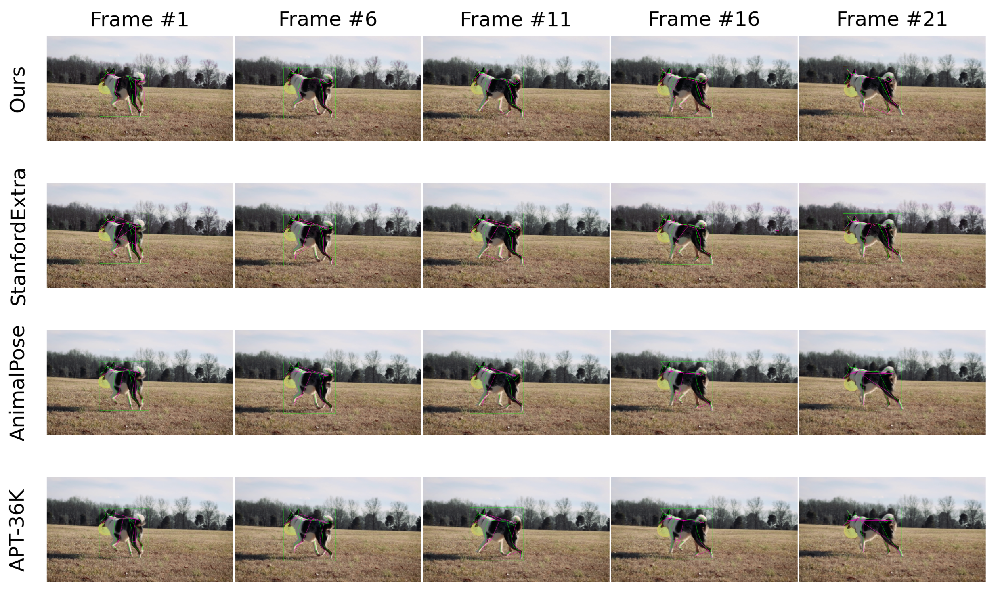

# A Synthetic Dog Video Dataset for Temporal Pose Estimation 

### Description 
This work was presented at the [CV4Animals] (https://www.cv4animals.com) workshop 2022 and was published in IJCV.

**[paper](https://link.springer.com/article/10.1007/s11263-023-01946-z)**



### Download 
Download the data from the following [link](https://cvssp.org/data/SyDogVideo/)

### To Do 
- [ ] Release of the training and testing code. 

## Citation 
```
@article{Shooter2023,
author={Shooter, Moira
and Malleson, Charles
and Hilton, Adrian},
title={SyDog-Video: A Synthetic Dog Video Dataset for Temporal Pose Estimation},
journal={International Journal of Computer Vision},
year={2023},
month={Dec},
day={29},
abstract={We aim to estimate the pose of dogs from videos using a temporal deep learning model as this can result in more accurate pose predictions when temporary occlusions or substantial movements occur. Generally, deep learning models require a lot of data to perform well. To our knowledge, public pose datasets containing videos of dogs are non existent. To solve this problem, and avoid manually labelling videos as it can take a lot of time, we generated a synthetic dataset containing 500 videos of dogs performing different actions using Unity3D. Diversity is achieved by randomising parameters such as lighting, backgrounds, camera parameters and the dog's appearance and pose. We evaluate the quality of our synthetic dataset by assessing the model's capacity to generalise to real data. Usually, networks trained on synthetic data perform poorly when evaluated on real data, this is due to the domain gap. As there was still a domain gap after improving the quality of the synthetic dataset and inserting diversity, we bridged the domain gap by applying 2 different methods: fine-tuning and using a mixed dataset to train the network. Additionally, we compare the model pre-trained on synthetic data with models pre-trained on a real-world animal pose datasets. We demonstrate that using the synthetic dataset is beneficial for training models with (small) real-world datasets. Furthermore, we show that pre-training the model with the synthetic dataset is the go to choice rather than pre-training on real-world datasets for solving the pose estimation task from videos of dogs.},
issn={1573-1405},
doi={10.1007/s11263-023-01946-z},
url={https://doi.org/10.1007/s11263-023-01946-z}
}
```
## Contact information 
Please contact [Moira Shooter](m.shooter@surrey.ac.uk) for enquiries.
